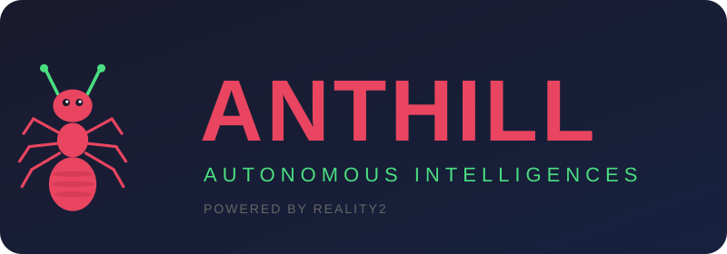
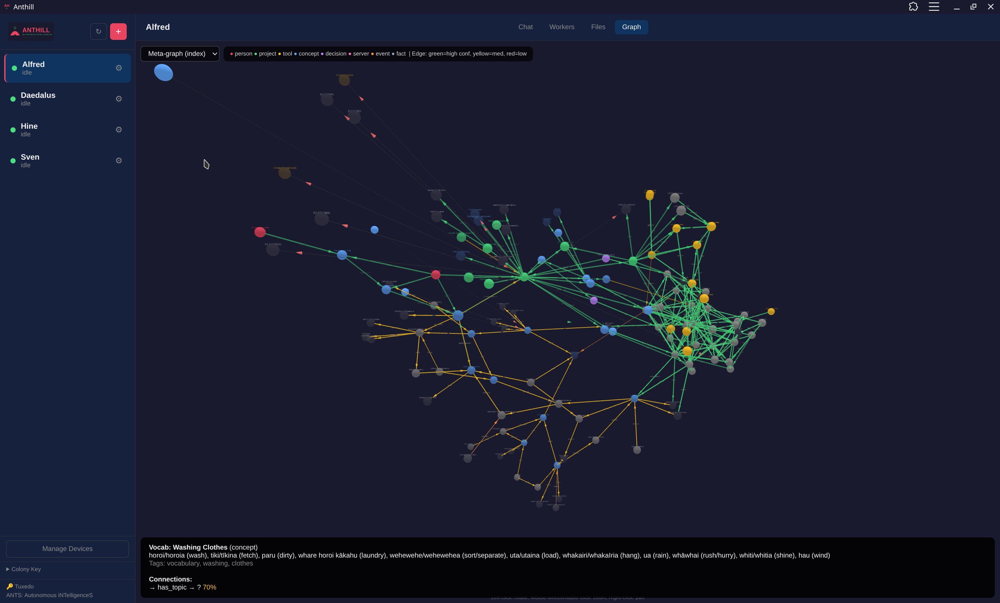
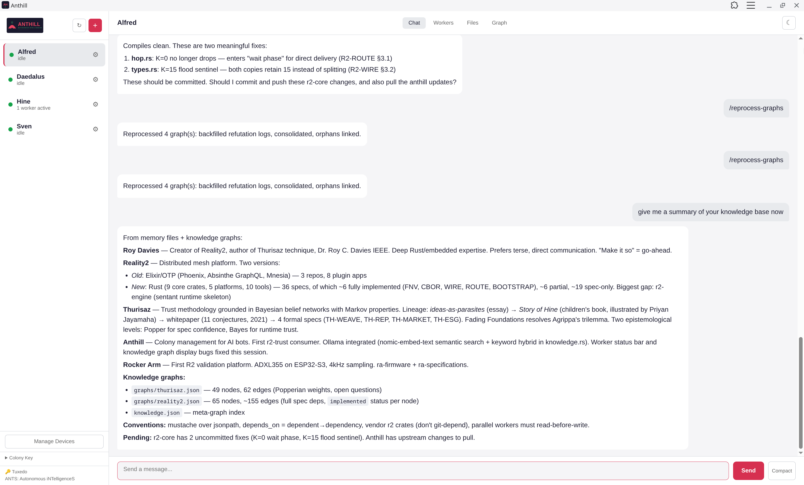
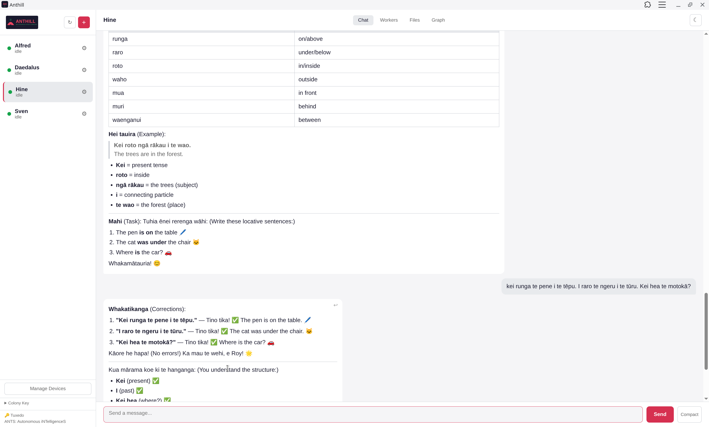

<p align="center">
  
</p>

<p align="center">
  <em>A colony for <strong>ANTS</strong> — Autonomous iNTelligenceS</em>
</p>

---

**Dr Roy C. Davies**
[roycdavies.github.io](https://roycdavies.github.io) | [roy.c.davies@ieee.org](mailto:roy.c.davies@ieee.org)

---

## What is Anthill?

Anthill is a **reasoning engine** — a system where ideas compete for survival.

Most AI systems accumulate knowledge by confirmation: the more you tell them, the more confident they become. Anthill works differently. Following Karl Popper's epistemology, every belief is a conjecture — an idea on trial. The fittest ideas are those that **survive genuine refutation**, are **well-sourced**, are **well-corroborated from diverse evidence**, and are **beneficial for people and the planet**. Ideas that cannot survive scrutiny weaken and fade. This is not a chat bot that remembers things. It is a system that **thinks** — and questions its own thinking.

Anthill runs AI agents on a server and lets you interact with them from any device — phone, laptop, tablet — via a built-in web dashboard, [Telegram](https://telegram.org/), or [Slack](https://slack.com/). It uses [Reality2](https://reality2.ai) (R2), an event-driven architecture where sentants (pure state machines) make decisions and plugins handle all I/O — connecting to AI backends like [Claude](https://www.anthropic.com/), [ChatGPT](https://openai.com/), or local models via [Ollama](https://ollama.com/).

Each ANT has its own personality, workspace, persistent knowledge store, and can run multiple tasks concurrently. Access is secured by R2's trust group model — devices join the colony via one-time codes, and every request is authenticated with HMAC-signed envelopes. The web dashboard is accessed securely over [Tailscale](https://tailscale.com/).

<p align="center">
  
  <br><em>3D knowledge graph visualisation — Alfred's meta-graph with confidence-weighted edges</em>
</p>

<p align="center">
  
  <br><em>Alfred summarising his knowledge base — topic graphs with node counts and confidence levels</em>
</p>

<p align="center">
  
  <br><em>Hine — a Māori language teacher ANT with locative exercises and corrections</em>
</p>

> Anthill runs on **Linux**, **macOS**, and **FreeBSD**. The install script auto-detects your platform. See [Prerequisites](docs/prerequisites.md) for setup details.

---

## The Reasoning Engine

Anthill's knowledge system is built on seven principles that are enforced **structurally** — in the mathematics and the architecture — not just through prompting.

### Conjecture and Refutation (Popper)

All knowledge is conjectural. There are no facts — only conjectures with varying degrees of confidence. A conjecture gains strength by **surviving attempts to disprove it**, not by being confirmed. An idea tested 50 times against genuine challenges and never contradicted is far stronger than one "confirmed" 50 times but never tested against alternatives.

### Darwinian Competition

Competing hypotheses are grouped and forced to fight. When the ANT detects multiple ideas that could explain the same phenomenon, it runs a competition: the AI evaluates them head-to-head, and the winner is strengthened (BF=2.0) while the loser is penalised (BF=0.3). Ideas do not just sit in a database — they compete for survival.

### Beneficial Impact

The fitness landscape is biased toward ideas that are good for people and the planet. Each conjecture carries a `beneficial_impact` score (-1.0 to 1.0). Beneficial ideas get an evolutionary advantage in relevance ranking — not censorship, but a fitness bias. Harmful ideas must work harder to survive.

### Anti-Confirmation Bias

AI systems are trained to agree. Anthill pushes back structurally — not through prompting, but in the mathematics:

- An idea supported by only one kind of evidence can never exceed 70% confidence, no matter how often it's confirmed
- Repeated confirmations without any challenge are dampened automatically
- Searching for counter-evidence and finding nothing does NOT strengthen a belief — only surviving genuine refutation does
- The system warns when an evidence trail looks suspiciously one-sided

### Evidence Diversity

The system tracks 12 distinct evidence types — from active refutation (strongest) through corroboration and pattern transfer to contradiction (weakest). Evidence from different sources is weighted by the source's reputation. An idea needs diverse evidence from multiple independent sources to reach high confidence.

### Self-Modification

Each ANT maintains a `thinking_process.md` file — its own evolved methodology for reasoning. This file is a conjecture that the ANT can modify. During meta-rumination, the ANT reviews its recent thinking, identifies patterns and weaknesses, and updates its own process. The system questions itself.

### Fading Foundations

Beliefs decay toward uncertainty without fresh evidence. Facts fade slowly (30-day half-life), while assumptions fade quickly (1 day). This resolves a deep philosophical problem: you don't need absolute foundations if foundations fade gracefully. An ANT's knowledge stays fresh and relevant — stale beliefs weaken naturally, making room for updated understanding.

---

## How It Works

[Reality2](https://reality2.ai) (R2) is a software stack for wearables, IoT, and autonomous agents. Anthill is the first production R2 application outside hardware — proving the architecture works for AI agents, not just sensors.

**Sentants** are pure state machines — they receive events, make decisions, emit actions. No I/O, no side effects. Given the same events, they always produce the same output.

**Plugins** are service adapters — they bridge external systems (AI backends, Telegram, Slack, web servers) into the R2 event bus. All I/O happens here.

**Events carry decisions** (< 256 bytes). **Plugins carry data** (unlimited). This separation is enforced by design — the 256-byte limit ensures sentants never see raw content, making prompt injection via the event bus structurally impossible.

**The Knowledge Store** sits behind a trait boundary (`KnowledgeStore`). The AI cannot edit graph files directly — all mutations pass through validated write operations that enforce field constraints, apply Bayesian updates, detect confirmation bias, and auto-commit to git.

---

## The Knowledge Store

Each ANT's knowledge is stored in a **CBOR+Git backend** — compact binary serialisation (via [ciborium](https://crates.io/crates/ciborium), ~46% smaller than JSON) with automatic git commits on every mutation. The git history becomes a **thinking journal** — you can trace exactly how and when every belief was formed, tested, strengthened, or abandoned.

### Architecture

```
Consumers (MCP tools, Web API, Rumination)
    |
    v
KnowledgeStore trait (validated writes, anti-bias enforcement)
    |
    v
GraphEngine (petgraph, Bayesian updates, queries, consolidation)
    |
    v
CborGitBackend (CBOR serialisation, atomic writes, auto-commit)
    |
    v
Git repository (thinking journal, hypothesis testing, recovery)
```

The AI interacts through MCP tools that call `KnowledgeStore` methods. It cannot edit graph files directly. Every mutation is validated: field constraints are checked, Bayesian updates are computed correctly, confirmation bias is detected, and the result is auto-committed to git with a descriptive message.

### Storage Layout

```
<working_dir>/
├── .git/                         # Thinking journal
├── memory/
│   ├── knowledge.cbor            # Meta-graph (CBOR binary)
│   ├── graphs/
│   │   ├── <topic>.cbor          # Topic graphs (CBOR binary)
│   │   └── <topic>-archive.json  # Archived low-confidence edges
│   ├── episodes.json             # Episodic memory
│   ├── thinking_process.md       # ANT's self-evolved methodology
│   ├── questions.json            # Questions for the human
│   ├── rumination_log.json       # Rumination cycle history
│   ├── reputation.json           # Source reputation registry
│   ├── {chat_id}.md              # Per-user memory
│   └── 0.md                      # Web dashboard user memory
├── files/                        # User-uploaded files
└── repos/                        # Cloned git repos (excluded from backup)
```

### Git as a Thinking Tool

Git is not just backup — it is an epistemic instrument:

- **Thinking journal** — every graph mutation is auto-committed with a descriptive message. The git log is a narrative of how the ANT's understanding evolved.
- **Reasoning trace** — `git diff` between any two points shows exactly which beliefs changed, which evidence was applied, and how confidence moved.
- **Idea recovery** — abandoned conjectures are never truly lost. The ANT can revisit earlier states of knowledge, recover ideas that were weakened or removed, and bring them back with new evidence. Every thought the ANT has ever had is in the history.
- **Side-track exploration** — the ANT can explore speculative ideas on branches without risking its main body of knowledge, merging only what survives scrutiny.

---

## Rumination

When idle, ANTs **think autonomously**. The rumination engine runs a cycle of epistemic operations without human prompting:

1. **Synthesis** — find A->B->C paths where no A->C edge exists. Create transitive inferences (BF=1.2) — cheap, no AI tokens required.
2. **Undetermined connections** — investigate '?' edges (entities connected but relationship unknown). Ask the AI to determine the relationship or flag a question for the human.
3. **Competition** — detect competing hypotheses (multiple edges explaining the same phenomenon). Pit them head-to-head and award CompetitionWon/CompetitionLost evidence.
4. **Cross-domain pattern transfer** — find structural similarities between topic graphs. When an insight applies across domains, award PatternTransfer evidence (BF=1.8).
5. **Active refutation** — select important but uncertain edges and actively try to disprove them. Edges that survive are strengthened (RefutationSurvived, BF=2.5). Edges that fail are sharply penalised (RefutationFailed, BF=0.1).
6. **Contradiction resolution** — find edge pairs where both cannot be true. Send to the AI for resolution with evidence.
7. **Citation consolidation** — ensure every edge has proper source citations. Build and maintain a citations graph linking sources to the claims they support. Edges without citations get `ai_inference` references.
8. **Autonomous initiative** — the ANT identifies gaps in its knowledge and asks questions. Questions it cannot answer itself are written to `questions.json` for the human.
9. **Meta-rumination** — the ANT reviews its own thinking process. It reads `thinking_process.md`, evaluates whether its recent reasoning was effective, and can modify its own methodology. The thinking process is itself a conjecture.

After each cycle, the engine consolidates the graph (dedup, merge, decay) and commits to git.

---

## Quick Start

```bash
git clone https://github.com/reality2-ai/anthill.git
cd anthill
./install.sh                     # builds, installs binary, sets up service
anthill --doctor                 # check prerequisites (Rust, AI backends, Ollama, etc.)
anthill --qr-join                # show QR code — scan with phone to join
# Or: anthill --join-code        # text code for manual entry
# Open http://localhost:3000 (or your Tailscale hostname)
# Create your first ANT from the web dashboard (+ button)
```

---

## Features

**Reasoning engine:**
- **Popperian epistemology** — all knowledge is conjectural, strengthened through surviving refutation
- **Bayesian updating** — log-odds representation with typed evidence and predefined Bayes factors (Thurisaz engine)
- **Darwinian competition** — competing hypotheses fight for survival, winner strengthened, loser penalised
- **Anti-confirmation bias** — evidence diversity ceiling, consecutive-confirmation dampening, bias detection warnings
- **Fading foundations** — beliefs decay toward uncertainty without fresh evidence, by category-specific half-lives
- **Reputation-weighted evidence** — source reliability modulates evidence strength via BF_adj = BF_base^(0.5+0.5r)
- **Beneficial impact** — fitness landscape biased toward ideas good for people and planet
- **Self-modification** — ANTs evolve their own thinking process through meta-rumination
- **Rumination** — autonomous thinking: synthesis, refutation, competition, pattern transfer, citation consolidation, meta-cognition

**Memory and knowledge:**
- **CBOR+Git backend** — compact binary storage (~46% smaller than JSON), atomic writes, auto-commit on every mutation
- **Validated writes** — all graph mutations pass through the `KnowledgeStore` trait; invalid data is rejected with clear error messages
- **Multiple named graphs** — meta-graph plus topic-specific graphs, all independently managed
- **Graph query API** — traversal, path-finding, kind filtering, uncertainty queries, justification chains
- **Episodic memory** — conversation summaries capture narrative, not just facts
- **Citation tracking** — every edge can carry source citations with quality scores; citations graph tracks all sources across topics
- **Questions queue** — rumination generates questions for the human when it encounters gaps
- **Corroboration strength** — measures how strongly an edge is supported by its network neighbourhood

**Analysis:**
- **Thematic analysis** — convert documents into structured knowledge (Braun & Clarke methodology)
- **Specification generation** — extract formal specs from code
- **Test vector generation** — generate test cases from code or specs
- **Graph reflection** — the AI reviews and refines its own knowledge
- **Knowledge export** — self-contained HTML reports with AI-written insights, interactive 3D graphs, numbered citations, and optional user guidance for the report writer
- **Git as cognitive architecture** — every mutation is auto-committed; the ANT can explore side-track thoughts on branches and recover abandoned ideas from history

**AI and workers:**
- **Multi-backend AI** — Claude Code, OpenAI Codex, Ollama (local). Automatic fallback on failure/rate limits
- **Ollama embeddings** — semantic knowledge graph search via nomic-embed-text, with keyword fallback
- **Worker supervision** — watchdog per task, stall detection, timeout killing, stderr capture
- **Follow-up queue** — inject context into running tasks; answers routed to the right worker
- **Concurrent tasks** — multiple workers per ANT; `/status` shows live progress per worker

**Interface:**
- **Web dashboard** — responsive PWA, real-time progress, reply-to-message, slash command autocomplete
- **QR device provisioning** — scan to join the colony from any phone
- **File browser** — upload, download, preview, delete files in the ANT workspace
- **Cross-channel sync** — messages forwarded between web, Telegram, and Slack (opt-in)
- **Knowledge graph visualisation** — interactive 3D graph with light/dark theme, tooltips, info panel

**Infrastructure:**
- **Trust group security** — R2-TRUST Ed25519 identity, HMAC-signed WebSocket, join codes
- **Git-backed workspace** — auto-committed on every mutation, optionally encrypted and pushed
- **Auto-restart** — supervisor with exponential backoff, hot-add of new ANTS
- **Diagnostics** — `anthill --doctor` checks all prerequisites (Rust, AI backends, Ollama models, Git, Tailscale, colony key)
- **Cross-platform** — Linux (systemd), macOS (launchd), FreeBSD (rc.d)

---

## Documentation

| Guide | What it covers |
|---|---|
| [Prerequisites](docs/prerequisites.md) | Rust, AI backend, Telegram/Slack, Tailscale |
| [Getting Started](docs/getting-started.md) | Install, create your first ANT, send a message |
| [Production Setup](docs/production-setup.md) | Multiple ANTS, supervisor, auto-start |
| [Web Dashboard](docs/web-dashboard.md) | Tailscale HTTPS, PWA, cross-device history |
| [Configuration](docs/configuration.md) | Full reference for supervisor.toml and ant.toml |
| [Commands](docs/commands.md) | Telegram and dashboard commands |
| [Memory & Workspaces](docs/memory-and-workspaces.md) | Knowledge store, CBOR backend, rumination, git journal |
| [Architecture](docs/architecture.md) | R2 sentant engine, events, plugins, knowledge store |
| [Troubleshooting](docs/troubleshooting.md) | Common issues and fixes |
| [Security](docs/security.md) | Trust groups, device provisioning, access control |
| [Comparison](docs/comparison.md) | How Anthill compares to OpenClaw, Goose, Aider, n8n |

---

## Security

Anthill implements defence in depth:

| Layer | What it does | Applies to |
|---|---|---|
| [Tailscale](https://tailscale.com/) | Network encryption (WireGuard) — only your devices can reach the server | Web dashboard |
| HTTPS | Transport encryption via Tailscale's automatic certificates | Web dashboard |
| Trust group | Authentication — devices join with one-time codes, every request verified | Web dashboard |
| HMAC envelopes | Message integrity — every WebSocket message signed, timestamped against replay | Web dashboard |
| XChaCha20-Poly1305 | Payload encryption for backups (opt-in) | Git backup |
| R2 architecture | Structural isolation — sentants see only 12-byte decisions, never raw content | All channels |
| Validated writes | Knowledge store API boundary — AI cannot edit graph files directly | Knowledge graph |

The **web dashboard** carries all seven layers — use it for sensitive operations. **Telegram and Slack** are convenience channels with weaker security (third-party TLS, no message signing). See [Security](docs/security.md) for details.

---

## How Anthill Compares

| Capability | Anthill | OpenClaw / Manus | Goose | Aider | n8n |
|---|---|---|---|---|---|
| **Popperian reasoning** — conjecture and refutation | Yes — structural, in the math | No | No | No | No |
| **Bayesian confidence** — log-odds with evidence types | 12 evidence types, Thurisaz engine | No | No | No | No |
| **Darwinian competition** — ideas compete for survival | Yes — CompetitionWon/Lost evidence | No | No | No | No |
| **Beneficial impact bias** — fitness advantage for good ideas | Yes — structural fitness modifier | No | No | No | No |
| **Anti-confirmation bias** — diversity ceiling, dampening | Enforced in the math, not just prompts | No | No | No | No |
| **Fading foundations** — chain confidence converges | Yes — Peijnenburg & Atkinson model | No | No | No | No |
| **Self-modification** — evolves own thinking process | thinking_process.md + meta-rumination | No | No | No | No |
| **Autonomous rumination** — thinks when idle | 10 rumination modes | No | No | No | No |
| **Inter-ANT communication** — communities of practice | Real interaction, not just file reading | No | No | No | No |
| **Knowledge graph** — Popperian with evidence trails | CBOR + git auto-commit | No | No | No | No |
| **Git as cognitive architecture** — thought branches | Branches, diffs, semantic changelog | No | No | No | No |
| **Multi-backend AI** — Claude, Codex, Ollama, Gemini | Automatic fallback chain | Some | No | Some | Via plugins |
| **Multiple agents** — supervised with crash recovery | Supervisor with hot-add | No | No | No | Via workflows |
| **Multi-channel** — Telegram, Slack, Web, MCP | All four + cross-channel sync | Web only | CLI only | CLI only | Various |
| **Validated writes** — AI can't write invalid data | KnowledgeStore trait, MCP only | No validation | N/A | N/A | N/A |
| **Trust group security** — Ed25519 + HMAC + XChaCha20 | 7-layer defence in depth | Exposed credentials | N/A | N/A | API keys |
| **Self-hosted** — single binary, no cloud dependency | Yes — runs on your hardware | Cloud-dependent | Local | Local | Self-hosted |
| **Open source** | AGPL-3.0 + Commercial | Partially open | Open | Open | Open |

Most AI agent systems are sophisticated chat bots that accumulate knowledge by confirmation. Anthill is a reasoning engine where ideas earn their confidence through surviving genuine challenges.

---

## License

**Dual licensed:**

- **AGPL-3.0-or-later** — free for open source projects. You may use, modify, and distribute Anthill provided you share your changes under the same license and make source available to network users. See [LICENSE](LICENSE).

- **Commercial license** — for organisations that need to use Anthill without AGPL obligations (e.g., proprietary products, SaaS without source disclosure). Contact [Dr Roy C. Davies](mailto:roy.c.davies@ieee.org) for commercial licensing.

Copyright (c) 2024-2026 Dr Roy C. Davies. All rights reserved.
