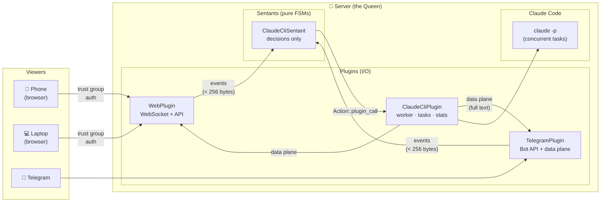

# Anthill

A colony for **ANTS** — Autonomous iNTelligenceS.

Anthill uses [Reality2](https://github.com/reality2-ai) (R2) — an open-source engine where autonomous agents (sentants) make decisions via events, and plugins handle all I/O. In Anthill, the sentants coordinate AI conversations while plugins manage [Claude Code](https://docs.anthropic.com/en/docs/claude-code), [Telegram](https://telegram.org/), and the web interface. R2's trust group model secures access — devices join the colony via one-time codes, and every request is authenticated.

Anthill runs AI agents on a server and lets you interact with them from any device — phone, laptop, tablet — via a built-in web dashboard or Telegram.

Each ANT has its own personality, workspace, persistent memory, and can run multiple tasks concurrently. Access is controlled by a trust group — devices join the colony via one-time join codes.

Built on the [Reality2](https://github.com/reality2-ai) (R2) sentant engine — the same event-driven architecture used for IoT sensor networks, now proven for AI agents.

## Quick start

```bash
git clone https://github.com/reality2-ai/anthill.git
cd anthill
cp anthill-example.toml anthill.toml
# Edit anthill.toml — set mode = "claude"
cargo run --release
```

Generate a join code and open the dashboard:

```bash
anthill --join-code              # prints a code (expires in 5 min)
# Open http://localhost:3000 → enter the code → you're in
```

## What is Reality2?

[Reality2](https://github.com/reality2-ai) (R2) is an event-driven architecture for autonomous agents — originally designed for IoT sensor networks on ESP32 microcontrollers, now proven to work for AI agents too.

The core principles:

- **Sentants** are pure state machines. They receive events, make decisions, emit actions. No I/O, no side effects, no network access. Given the same events, they always produce the same actions. Deterministic and testable.

- **Plugins** are service adapters. They bridge external systems (Telegram, Claude Code, web servers, hardware) into the event bus. All I/O happens here.

- **Events carry decisions** (< 256 bytes) — IDs, state codes, routing signals. **Plugins carry data** — message text, AI responses, file contents. If it doesn't fit in 256 bytes, it belongs in the plugin data plane, not the event bus.

- **Trust groups** control access. Devices join a colony by presenting a join code (R2-TRUST provisioning). Every API call and WebSocket connection is authenticated. The colony server is the queen; browsers and phones are authenticated viewers.

Anthill is the first production application of R2 outside sensor networks. The same architecture that coordinates accelerometer readings on ESP32s now coordinates AI agent conversations from phones.

### How Anthill uses R2



**Sentants** make decisions. **Plugins** handle data. Events are tiny. Data flows plugin-to-plugin.

| Sentants (pure FSMs — zero I/O) | Plugins (all I/O) |
|---|---|
| ClaudeCliSentant — dispatches, routes, commands | ClaudeCliPlugin — Claude Code, tasks, stats, sends |
| AiSentant — NL→command→summary pipeline | AiMediationPlugin — API calls, buffering, history |
| ChunkerSentant — output batching decisions | ChunkerPlugin — ANSI stripping, chunking, sends |
| TerminalSentant — PTY lifecycle | TelegramPlugin — Bot API, classification, data plane |
| TelegramSentant — session routing | PtyPlugin — pseudo-terminal management |

## Features

- **Multiple ANTS** — each with its own personality, workspace, and optional Telegram bot
- **Web dashboard** — responsive, installable as PWA, accessible via [Tailscale](https://tailscale.com/)
- **Trust group security** — join codes, device provisioning, auth on every request
- **Concurrent tasks** — send messages while others are running; `/ants` to check progress
- **Real-time progress** — see what each worker is doing (tool use, agent spawns)
- **Per-user memory** — persistent across conversations and restarts
- **File browser** — browse workspace, upload/download files, preview images and code
- **Git-backed workspace** — auto-committed on schedule, optionally pushed to GitHub
- **ANT management UI** — create, configure, delete ANTS from the dashboard
- **Device management** — provision/revoke devices from the dashboard
- **Telegram optional** — ANTS work with web dashboard only, Telegram is an add-on
- **Markdown rendering** — code blocks, headings, tables, links in both Telegram and web
- **Auto-restart** — supervisor manages ANTS with exponential backoff
- **Systemd integration** — starts on boot, HTTPS via Tailscale

## Documentation

| Guide | What it covers |
|---|---|
| [Prerequisites](docs/prerequisites.md) | Rust, Node.js, Claude Code, Telegram, Tailscale |
| [Getting Started](docs/getting-started.md) | Single ANT setup, first message |
| [Production Setup](docs/production-setup.md) | Multiple ANTS, supervisor, systemd |
| [Web Dashboard](docs/web-dashboard.md) | Tailscale HTTPS, PWA, cross-device history |
| [Configuration](docs/configuration.md) | Full reference for supervisor.toml and ant.toml |
| [Commands](docs/commands.md) | Telegram and dashboard commands |
| [Memory & Workspaces](docs/memory-and-workspaces.md) | Per-user memory, git backups |
| [Architecture](docs/architecture.md) | R2 sentant engine, events, plugins |
| [Troubleshooting](docs/troubleshooting.md) | Common issues and fixes |
| [Security](docs/security.md) | Trust groups, device provisioning, access control |

## License

MIT OR Apache-2.0
