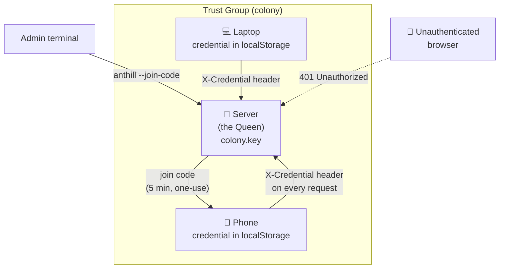

# Security

## Trust group model

Anthill implements R2-TRUST — the same provisioning model designed for IoT sensor networks. The colony is a **trust group**. The server is the **queen**. Browsers and phones are **viewers** that must be provisioned to join.



### How it works

1. **Colony root secret** — generated automatically on first run (`colony.key`). This is the trust group's key material.

2. **Join codes** — derived from the root secret, valid for 5 minutes, one-use. Generated via the CLI (`anthill --join-code`) or from the web dashboard.

3. **Device credentials** — when a device joins with a valid code, it receives a permanent credential. This is stored in the browser's `localStorage` and in `devices.toml` on the server.

4. **Authentication** — every API call and WebSocket connection must present a valid credential. The server verifies it against `devices.toml`. No credential = rejected.

### What's protected

| Route | Auth required |
|---|---|
| `GET /` (HTML, assets, icons) | No |
| `POST /api/auth/join` | No (needs join code) |
| `POST /api/auth/verify` | No (checks credential) |
| `GET /api/auth/status` | No (is colony empty) |
| `GET /ws` (WebSocket) | Yes (credential in query) |
| **All other `/api/*` routes** | **Yes (X-Credential header)** |

### Managing devices

From the web dashboard sidebar:
- **Generate Join Code** — creates a code for a new device
- **Manage Devices** — lists all provisioned devices with names, join dates, last seen
- **Revoke** — removes a device's credential (they'll need a new code to rejoin)

From the CLI:
```bash
anthill --join-code    # generate a code
```

## Bot tokens are secrets

`ant.toml` files contain Telegram bot tokens. They live in `~/.config/anthill/ants/` which is outside the repo. The `.gitignore` excludes `anthill.toml` (single-bot mode config).

## skip_permissions

In `claude` and `ai` modes, `skip_permissions` is automatically set to `true`. This passes `--dangerously-skip-permissions` to Claude Code, giving the ANT full shell access as your user.

**Always use the Telegram `allow` list** to restrict which chat IDs can interact. Without it, anyone who discovers your bot username can execute commands.

## The web dashboard has trust group auth

Unlike earlier versions, the web dashboard now requires authentication. Without a valid credential (obtained via a join code), all API calls return 401 Unauthorized and the WebSocket connection is refused.

The join screen is the only thing visible to unauthenticated users.

## Don't run as root

Anthill runs commands with the same permissions as the user running the service. Create a dedicated user if you want to limit access.

## Memory files

Per-user memory files accumulate context over time — project names, file paths, preferences. They're stored in the working directory, backed up to git, but not encrypted.

## Recommendations

1. **Use Tailscale** for the web dashboard — don't expose port 3000 to the public internet
2. **Use HTTPS** via `tailscale serve` — encrypts traffic, enables secure WebSocket
3. **Set `allow`** in Telegram config — restrict to your chat ID
4. **Review provisioned devices** periodically — revoke ones you don't recognise
5. **Keep `colony.key` safe** — anyone with this file can generate join codes
6. **Use private repos** for git backup remotes — memory may contain sensitive context
