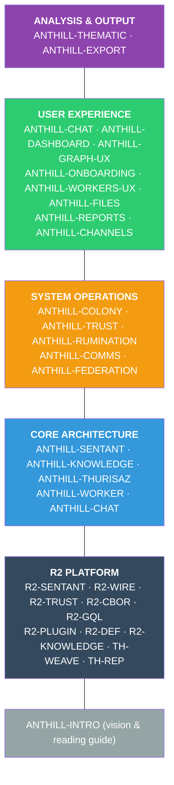

# Anthill — Specification Map

**Version:** 0.1 Draft
**Date:** 2026-03-30
**Total specs:** 20 planned (6 complete, 14 pending)

---

## Overview

---

## Core Architecture (Priority 1)

| Spec | Description | Depends on | Status |
|------|-------------|------------|--------|
| **[ANTHILL-INTRO](ANTHILL-INTRO.md)** | Vision, philosophy, R2 relationship, reading guide | R2-WIRE, R2-SENTANT, R2-TRUST | ✅ Done |
| **[ANTHILL-SENTANT](ANTHILL-SENTANT.md)** | ANT lifecycle, IPUCO properties, conductor FSM, definition format | R2-SENTANT, R2-WIRE, R2-TRUST, R2-DEF, R2-PLUGIN | ✅ Done |
| **[ANTHILL-KNOWLEDGE](ANTHILL-KNOWLEDGE.md)** | Knowledge store, CBOR+Git backend, graph operations, MCP tools, data reduction | ANTHILL-SENTANT, R2-CBOR, R2-KNOWLEDGE | ✅ Done |
| **[ANTHILL-THURISAZ](ANTHILL-THURISAZ.md)** | Bayesian epistemology, 12 evidence types, anti-confirmation bias, decay, reputation | ANTHILL-KNOWLEDGE, TH-WEAVE, TH-REP | ✅ Done |
| **[ANTHILL-WORKER](ANTHILL-WORKER.md)** | AI backend abstraction, worker supervision, multi-backend fallback, watchdog | ANTHILL-SENTANT, R2-PLUGIN | ✅ Done |
| **[ANTHILL-CHAT](ANTHILL-CHAT.md)** | Conversation model, slash commands, follow-ups, interrupts, cross-channel sync | ANTHILL-SENTANT, ANTHILL-WORKER | ✅ Done |

## System Operations (Priority 2)

| Spec | Description | Depends on | Status |
|------|-------------|------------|--------|
| **ANTHILL-COLONY** | Colony supervisor, ANT lifecycle, hot-add/restart, config reload | ANTHILL-SENTANT, ANTHILL-TRUST | 🔲 Pending |
| **ANTHILL-TRUST** | Trust group security, device provisioning, join codes, HMAC WebSocket | R2-TRUST, R2-PROVISION | 🔲 Pending |
| **ANTHILL-RUMINATION** | Autonomous thinking — 9 modes, synthesis, refutation, competition, citations, meta-rumination | ANTHILL-KNOWLEDGE, ANTHILL-THURISAZ, ANTHILL-WORKER | 🔲 Pending |
| **ANTHILL-COMMS** | Inter-ANT communication, colony inbox/outbox, Socratic discourse, loop detection | ANTHILL-SENTANT, ANTHILL-COLONY | 🔲 Pending |
| **ANTHILL-FEDERATION** | Distributed deployment, relay protocol, web gateway sentant, multi-node topology | ANTHILL-COLONY, ANTHILL-TRUST, R2-INTERNET, R2-TRANSPORT | 🔲 Pending |

## User Experience (Priority 2–3)

| Spec | Description | Depends on | Status |
|------|-------------|------------|--------|
| **ANTHILL-DASHBOARD** | Web dashboard layout, tabs, responsive design, PWA, theme switching | ANTHILL-CHAT, ANTHILL-SENTANT | 🔲 Pending |
| **ANTHILL-GRAPH-UX** | Knowledge graph interaction — 3D visualisation, node click/right-click, query bar | ANTHILL-KNOWLEDGE, ANTHILL-DASHBOARD | 🔲 Pending |
| **ANTHILL-ONBOARDING** | Device provisioning UX, QR scan, join code, first ANT wizard, /doctor | ANTHILL-TRUST, ANTHILL-DASHBOARD | 🔲 Pending |
| **ANTHILL-WORKERS-UX** | Task visibility — workers tab, live progress, follow-up input, cancel, questions | ANTHILL-WORKER, ANTHILL-DASHBOARD | 🔲 Pending |
| **ANTHILL-FILES** | File management UX — browse, upload, download, preview, sandboxed workspace | ANTHILL-SENTANT, ANTHILL-DASHBOARD | 🔲 Pending |
| **ANTHILL-REPORTS** | Report/export workflow — scope, guidance, citations, background generation | ANTHILL-KNOWLEDGE, ANTHILL-DASHBOARD | 🔲 Pending |
| **ANTHILL-CHANNELS** | Multi-channel experience — web, Telegram, Slack consistency, feature parity | ANTHILL-CHAT, ANTHILL-TRUST | 🔲 Pending |

## Analysis & Output (Priority 3)

| Spec | Description | Depends on | Status |
|------|-------------|------------|--------|
| **ANTHILL-THEMATIC** | Analysis pipelines — Braun & Clarke, /analyse, /specify, /test-vectors | ANTHILL-KNOWLEDGE, ANTHILL-WORKER | 🔲 Pending |
| **ANTHILL-EXPORT** | Export format — self-contained HTML, 3D graph, AI narrative, citations | ANTHILL-KNOWLEDGE, ANTHILL-THURISAZ | 🔲 Pending |

---

## R2 Platform Dependencies

Anthill depends on the following R2 core specifications. See
[ANTHILL-INTRO §3.1](ANTHILL-INTRO.md) for the full dependency table
including implementation status and gaps.

| R2 Spec | Anthill Usage |
|---------|---------------|
| R2-WIRE | Event framing, 256-byte limit |
| R2-FNV | Event name hashing |
| R2-CBOR | Knowledge graph serialisation |
| R2-TRUST | Colony trust group, device provisioning |
| R2-SENTANT | ANT as sentant, IPUCO properties |
| R2-DEF | Sentant definition format |
| R2-PLUGIN | Plugin model |
| R2-GQL | GraphQL management plane |
| R2-KNOWLEDGE | Knowledge graph data model |
| R2-TRANSPORT | Transport binding abstraction |
| R2-INTERNET | WebSocket relay (federation) |
| R2-PROVISION | Device provisioning UX |
| TH-WEAVE | Epistemic mathematics (Bayesian) |
| TH-REP | Source reputation scoring |
